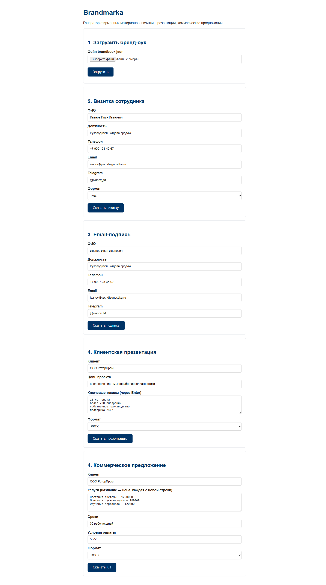
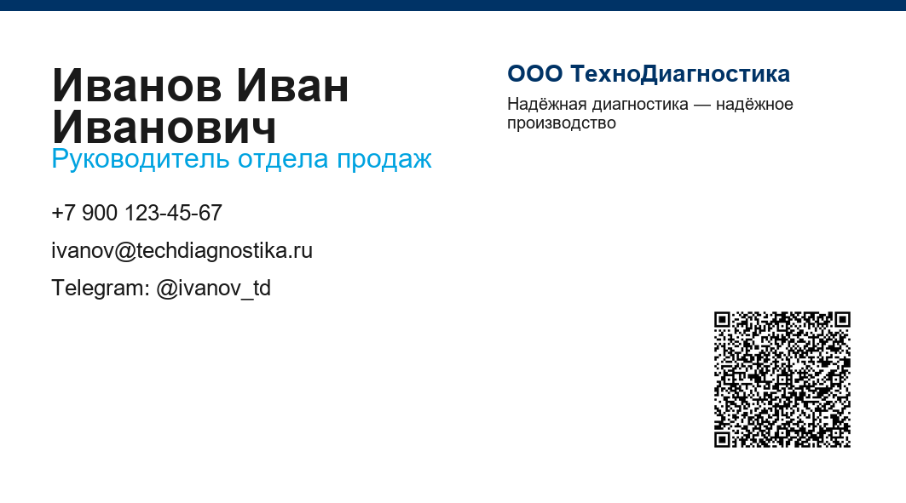

# Brandmarka

Автогенератор фирменных маркетинговых материалов в едином бренд-стиле.

**Демо-репозиторий:** https://github.com/Katy-Klochkova/brandmarka



## Проблема

В B2B-компаниях фирменные материалы часто собираются вручную: визитки разных сотрудников выглядят по-разному, клиентские презентации копируются из старых файлов, коммерческие предложения занимают часы, а бренд-бук остаётся PDF, которым никто не пользуется. В итоге фирменный стиль плавает, а менеджеры тратят время на рутину вместо продаж.

## Пользователь

Маркетологи, руководители отделов продаж и владельцы B2B-бизнеса, которым нужно быстро выпускать визитки, презентации и коммерческие предложения без привлечения дизайнера и верстальщика.

## Основная функция

Brandmarka превращает бренд-бук компании в генератор документов.

**На вход:**

- бренд-бук компании (логотип, цвета, шрифты, тон голоса, контактные данные);
- данные о сотруднике или клиенте в формате JSON.

**Что происходит внутри:**

1. Сервис загружает и валидирует бренд-бук.
2. Выбирает нужный шаблон (визитка, email-подпись, презентация, КП).
3. При необходимости дорабатывает текст через LLM с учётом тона и стиля бренда.
4. Рендерит готовый файл по шаблону.

**Поддерживаемые материалы:**

- визитки сотрудников с QR-кодом vCard (PNG);
- HTML email-подписи;
- клиентские презентации (PPTX);
- коммерческие предложения (DOCX).

## Формат результата

Пользователь получает готовые файлы в папке `output/`:

- **PNG** — визитки;
- **HTML** — email-подписи;
- **PPTX** — презентации;
- **DOCX** — коммерческие предложения.

Файлы можно сразу отправить клиенту, распечатать или вставить в письмо.

## Минимальный функционал (MVP)

1. Загрузка бренд-бука компании.
2. Генерация визиток сотрудников.
3. Генерация HTML email-подписей.
4. Генерация клиентских презентаций по шаблону.
5. Генерация коммерческих предложений.
6. Веб-интерфейс и REST API.
7. Экспорт результатов в PNG/HTML/PPTX/DOCX + PDF для визиток.

**В планах:**

- PDF-экспорт презентаций и КП без LibreOffice;
- подключение Claude API для автоматической генерации текста;
- личный кабинет с ролями;
- интеграции с CRM;
- библиотека стоковых изображений;
- мультиязычность.

## Технологии

- **Python 3.12+** — основной язык
- **FastAPI** — backend и REST API
- **HTML + JavaScript** — простой фронтенд без фреймворков
- **Pillow** — генерация визиток и их PDF-экспорт
- **python-pptx** — генерация презентаций
- **python-docx** — генерация коммерческих предложений
- **LibreOffice** — конвертация PPTX/DOCX в PDF (опционально)
- **qrcode** — генерация QR-кодов vCard
- **Anthropic Claude API** — генерация и доработка текста (подготовлено, но пока не используется в MVP)
- **JSON-файлы на диске** — хранение данных в MVP

## Демо результата

### Пример визитки



Другие примеры лежат в папке `docs/`:
- `business-card-example.pdf` — визитка в PDF;
- `email-signature-example.html` — HTML email-подпись;
- `presentation-example.pptx` — клиентская презентация;
- `proposal-example.docx` — коммерческое предложение.

## Структура проекта

```
brandmarka/
├── data/                # бренд-бук и данные проектов
├── demo/                # примеры входных JSON
├── design/              # шаблоны бренд-бука и промпты
├── docs/                # документация: концепция, архитектура, MVP
├── output/              # сгенерированные файлы
├── src/
│   ├── api/             # FastAPI эндпоинты
│   ├── cli/             # консольная утилита
│   ├── core/            # бренд-бук, конфиг, LLM
│   ├── generators/      # генераторы материалов
│   └── web/             # HTML-интерфейс
├── .env.example         # пример файла с API-ключом
├── .gitignore           # файлы, которые не попадают в Git
├── README.md            # этот файл
├── requirements.txt     # зависимости Python
├── run.py               # запуск CLI
└── web.py               # запуск веб-сервера
```

## Установка и запуск

### 1. Клонирование и подготовка окружения

```bash
git clone https://github.com/Katy-Klochkova/brandmarka.git
cd brandmarka

python -m venv .venv

# Windows
.venv\Scripts\activate

# macOS/Linux
source .venv/bin/activate

pip install -r requirements.txt
```

### 2. Бренд-бук

По умолчанию используется файл `data/brandbook.json`. Его уже создали в репозитории. Если нужно свой — замени его или загрузи через веб.

### 3. Запуск через веб-интерфейс

```bash
python web.py
```

Открой в браузере: `http://127.0.0.1:8000`

На странице можно загрузить бренд-бук и сгенерировать визитку, подпись, презентацию или КП.

### 4. Запуск через командную строку

```bash
# Посмотреть справку
python run.py --help

# Генерация визитки
python run.py business-card --input demo/sample-inputs/employee.json

# Визитка в PDF
python run.py business-card --input demo/sample-inputs/employee.json --format pdf

# Генерация email-подписи
python run.py email-signature --input demo/sample-inputs/employee.json

# Генерация презентации
python run.py presentation --input demo/sample-inputs/client.json

# Презентация в PDF (требуется LibreOffice)
python run.py presentation --input demo/sample-inputs/client.json --format pdf

# Генерация коммерческого предложения
python run.py proposal --input demo/sample-inputs/proposal.json

# КП в PDF (требуется LibreOffice)
python run.py proposal --input demo/sample-inputs/proposal.json --format pdf

# Загрузка своего бренд-бука
python run.py upload-brandbook --file data/brandbook.json
```

### 5. Подключение Claude API (опционально)

Для генерации текста через Claude создай файл `.env` в корне:

```env
ANTHROPIC_API_KEY=sk-ant-...
```

Шаблон есть в файле `.env.example`.

## Лицензия

MIT — свободное использование и доработка.
